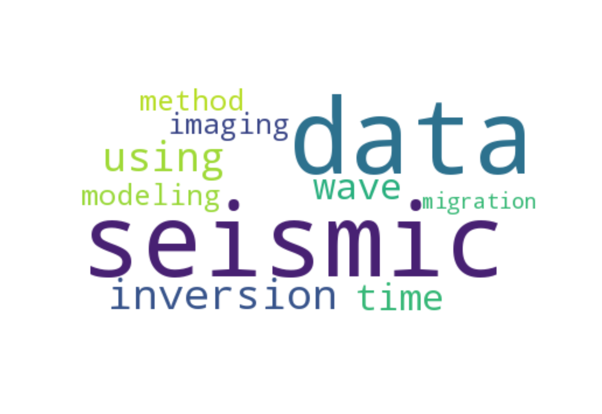
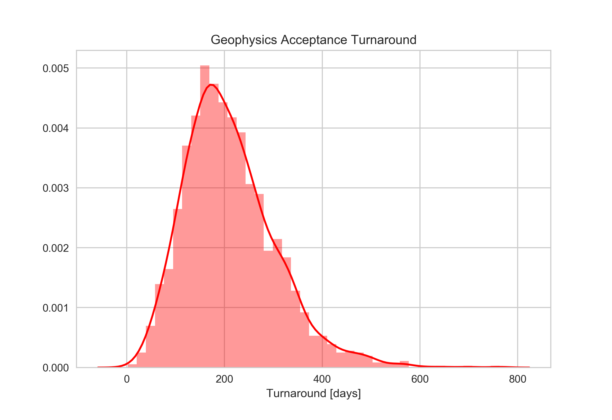
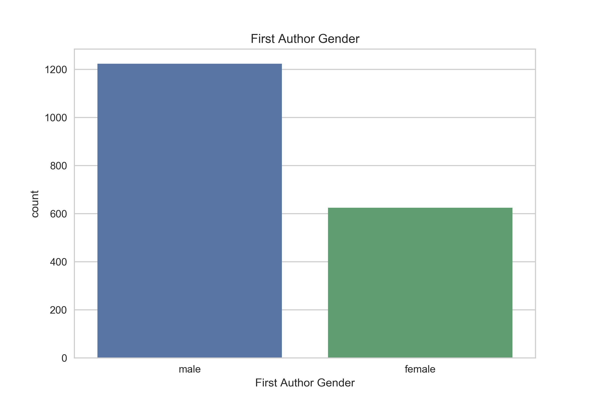

# Natural Language Processing NLP

## Objective
Do you wonder what are the most used words in the titles of **Geophysics** journal from Society of Exploration Geophysicists? Or, how long
does it take on average to get a paper accepted? And what about the proportion of male and female authors?

To answer these (and many other) questions, I decided to follow the [Data Camp tutorial on webscraping and NLP](https://www.datacamp.com/community/blog/fb-live-annoucement)
and to learn how to scrape information from a website and perform some basic natural language processing (NLP) in Python. 
After lots of tweaking and changes required to be able to web scrape what you wanted from the website of [Geophysics journal](http://library.seg.org/loi/gpysa7) (so do not expect anything to work 
out-of-the-box if trying to do similar stuff on another website), I got what I needed from each article written in Geophysics in the last 5 years and answered my questions.

Finally I attempted to perform some machine learning to estimate the category of a paper given the words in its title (using bag-of-words approach).
Not so easy but surprisingly enough I can place papers in the 'Borehole geophysics and rock properties' category with precision and recall of about 80%. 

## Description
This repo contains two notebooks:
* NLP_SEG_datacollection.ipynb: web scrape information from articles and save them for later analysis. Run it to collect data to analyse.
In the data folder I have already collected data from the last 5 years, but any volume can be scraped within this notebook (although things 
have evolved over time and some information like keywords or country of affiliation may not be present in old volumes...)
* NLP_SEG_analysis.ipynb: analyse scraped data and perform statistics. 

As you go along you will be able to produce plots like this one, a wordcloud of the most used words in the journal titles using [Andreas Mueller word_cloud package](https://github.com/amueller/word_cloud). 
And it turns out that *data* and *seismic* are the most used words, geophysicists do not seem to have much imagination when coming up with titles!
<p align="center">

</p>

It's also interesting to realise that it takes us (authors and reviewers) on average more than half a year to get a paper in shape to be worth of publication.
<p align="center">

</p>

Finally, by applying a [gender classifier](https://gist.github.com/vinovator/6e5bf1e1bc61687a1e809780c30d6bf6) based on nltk.NaiveBayesClassifier on the first author of each paper, 
I gained some insight into the male-to-female ratio in journal publications. Not so bad to see male first authors are just below twice the number of female first authors given
the predominant number of male members of the society as shown in this TLE [paper](https://library.seg.org/doi/abs/10.1190/tle34060708.1).

<p align="center">

</p>

## Getting started


### 1. Clone the repository

Executing the following in your terminal:

```
git clone https://github.com/mrava87/SEG_NLP.git
```

Alternatively, you can download the zip file of the repository at the top of the main page.


### 2. Install the correct packages

To ensure that you can reproduce my results, the requirements.txt file contain a list of the packages used in my notebooks and their specific version.

To install those packages simply run 
```
pip install -r /path/to/requirements.txt
```


